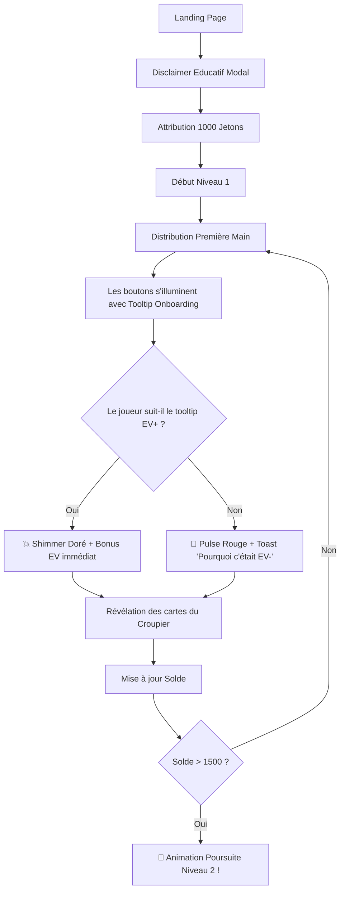

# UX Design Specification bmad-test

**Author:** Esciner
**Date:** 2026-04-01T14:12:42+02:00

---

## Executive Summary

### Project Vision
An educational web application that teaches probability and game theory through gamified Blackjack. The core UX innovation is decoupling the feeling of "winning" from card luck and anchoring it to mathematically optimal decisions (Expected Value). The application must feel like a premium casino game while functioning as an effective learning tool.

### Target Users

**Alice — The Curious Beginner (Primary)**
- Zero probability knowledge, intimidated by math, attracted by gamified format
- Technologically capable of using a basic web app; primarily mobile user
- Needs: gentle learning curve, constant positive reinforcement, visual clarity

**Bob — The Gut-Feeling Player (Secondary)**
- Knows Blackjack rules but plays by instinct, ignoring math
- Needs: correction without humiliation, forced rehabilitation through the anti-softlock loop
- Key UX concern: the "Back to Basics" transition must feel like coaching, not punishment

**Charlie — The Administrator (Tertiary)**
- Technical profile; accesses a configuration panel to tune game economy
- Needs: clear metrics dashboard, safe configuration controls with immediate feedback

### Key Design Challenges

1. **Cognitive Dissonance Resolution:** The player may make a mathematically perfect decision yet still lose the hand due to variance. The visual system must celebrate the *decision* before the *outcome* is revealed to anchor the feeling of success on the correct trigger. Animation timing is the single most critical UX element.

2. **Mobile-First Blackjack Table:** Fitting the dealer's cards, player's cards, action buttons (Hit/Stand/Double), virtual currency balance, AND educational tooltips on a 375px-wide portrait screen without clutter. Touch targets must be thumb-accessible.

3. **Level Transition Feel:** Level 1 (Dumb AI + training aids) must feel noticeably different from Level 2 (standard casino) so the transition feels like a genuine accomplishment, not a loss of helpful features.

### Design Opportunities

1. **"Juice" as Pedagogy:** Micro-animations (flying chips, confetti on EV+ decisions, haptic feedback on mobile) are not cosmetic — they are the primary positive reinforcement mechanism. This creates a Pavlovian "good decision = dopamine" loop.

2. **Interactive EV Visualization:** Transform the basic strategy chart from a static PDF reference into an integrated, interactive game element — a "weapon" the player learns to master.

3. **"Back to Basics" as Narrative Moment:** Instead of a frustrating "Game Over" screen, design a warm, coaching-tone transition ("The professor welcomes you back for a refresher session") that reframes failure as growth.

## Core User Experience

### Defining Experience
The singular interaction that defines this product is the 2-second sequence: **Decision → Celebration → Outcome Reveal**. The player taps "Hit" or "Stand", sees an immediate visceral positive UI celebration confirming their EV-optimal choice, and *then* watches the dealer's cards flip. If this sequence feels good, everything else follows. If it doesn't, nothing else matters.

**The Core Loop:**
1. See your hand + dealer's visible card
2. Consult EV hints (Level 1) or rely on learned instinct (Level 2)
3. Tap your action (Hit/Stand/Double)
4. **Receive instant EV feedback** (celebration if optimal, gentle correction if not)
5. Watch the hand play out (dealer reveals + resolution)
6. See bankroll updated (standard payout ± EV bonus)
7. Repeat

### Platform Strategy
- **Primary:** Mobile web (responsive, portrait mode, touch-first)
- **Secondary:** Desktop web (mouse + keyboard shortcuts: Space=Hit, Enter=Stand)
- **Rendering:** NuxtJS SSR for SEO landing pages, SPA-mode for the actual game engine
- **Offline:** Not required for MVP. All logic is client-side but no explicit PWA/offline mode.
- **Device capabilities:** Haptic feedback on mobile for EV+ decisions (if available via Vibration API)
- **Internationalization:** 4 languages supported (FR default, NL, EN, DE). All user-facing text uses i18n keys via `@nuxtjs/i18n`. A `LanguageSwitcher` component in the Balance Bar allows manual language selection. Browser language is auto-detected on first visit.

### Effortless Interactions
- **Placing a bet** should require a single tap (default bet = last bet used)
- **EV hints in Level 1** should appear automatically without the player needing to search for them
- **The "Back to Basics" transition** should happen seamlessly — no modal walls, no "Are you sure?" interruptions
- **Game state persistence** must be invisible — the player never thinks about saving; it just works
- **Onboarding** should be woven into the first 3 hands, not presented as a separate tutorial the user wants to skip

### Critical Success Moments
1. **"Aha!" Moment:** The first time a player makes a counter-intuitive but mathematically correct move (e.g., hitting on 16 vs dealer's 10), *loses the hand*, but still sees their EV bonus go up and a celebration animation. This is the moment the product's value becomes clear.
2. **Level Unlock:** The transition from Level 1 → Level 2 must feel like a graduation ceremony, not just a screen change.
3. **Recovery Pride:** When Bob returns from the "Back to Basics" loop, the UI should communicate "Welcome back, you've leveled up your skills" — turning a potentially shameful moment into a pride moment.

### Experience Principles
1. **"Celebrate the Decision, Not the Cards"** — Every UI animation, sound, and visual cue must reinforce that the *choice* is the win, not the hand outcome.
2. **"Learn by Playing, Not by Reading"** — Education is embedded in gameplay, never in separate tutorial screens or walls of text.
3. **"Failure is a Feature"** — Going bankrupt and returning to Level 1 is designed into the game as a positive learning mechanism, not a punishment.
4. **"Casino Feel, Classroom Brain"** — The visual polish must match a premium casino app; the underlying mechanics must teach rigorous math.

## Desired Emotional Response

### Primary Emotional Goals
- **Empowerment** — "I understand something that used to feel like black magic." The player should feel intellectually elevated by having decoded probability, not intimidated by it.
- **Addictive Curiosity** — "I want to play just one more hand to see if I can get the next tricky situation right." The loop should trigger the same engagement as a puzzle game, not a slot machine.
- **Pride in Process** — "I made the right call even though the cards didn't go my way, and the app acknowledged it." This is the emotional anchor for the entire product.

### Emotional Journey Mapping

| Stage | Target Emotion | Anti-Emotion (Avoid) |
|---|---|---|
| **First Visit** | Intrigued, welcomed, zero intimidation | Overwhelmed, confused, "this looks like math homework" |
| **First 3 Hands (Onboarding)** | Playful curiosity — "Oh, this is fun!" | Boredom from reading tutorial text |
| **First EV+ Decision** | Surprise & delight — "Wait, I got rewarded even though I lost?" | Frustration — "Why did I lose chips if I played correctly?" |
| **Level 1 Mastery** | Growing confidence — "I'm starting to see the patterns" | Impatience — "When do I get to the real game?" |
| **Level 2 Unlock** | Accomplishment, graduation pride | Anti-climax — "That's it?" |
| **Going Bankrupt** | Gentle humor — "Oops, back to school!" | Shame, anger, "this game is rigged" |
| **Back to Basics Loop** | Determined — "I know what I did wrong, let me fix it" | Humiliation, punishment feeling |
| **Return to Level 2** | Redemption pride — "I earned this; I'm better now" | "This is a grind" |

### Micro-Emotions

- **Confidence vs. Confusion:** The EV hints must create confidence, never add visual noise. In Level 1, the hints are generous and clear. In Level 2, they fade away, replaced by the player's own internalized knowledge.
- **Excitement vs. Anxiety:** Card dealing animations must build *excitement* (controlled suspense), not *anxiety*. The dealer's card flip should feel like opening a gift, not a threat.
- **Accomplishment vs. Frustration:** Every single hand must end with a micro-accomplishment — either "Great EV decision!" or "Here's what the optimal play was." Never a naked "You lost."

### Design Implications

| Emotion Target | UX Design Choice |
|---|---|
| **Empowerment** | EV tooltips use simple language + visual indicators (green/red glow), never raw math notation |
| **Addictive Curiosity** | Each hand reveals something new; the deck state creates natural variety |
| **Pride in Process** | EV bonus celebration fires BEFORE the dealer flips — 500ms gold shimmer + chip sound |
| **Zero Intimidation** | Onboarding is 3 guided hands, not a text wall; uses progressive disclosure |
| **Gentle Humor on Failure** | "Back to Basics" uses warm, encouraging copy + a friendly character/icon |
| **Graduation Pride** | Level 2 unlock triggers a full-screen celebration animation with a congratulatory message |

### Emotional Design Principles
1. **"Reward First, Reveal Second"** — The EV feedback animation always fires before the outcome reveal. The player's emotional state is "I won" before they even see the final cards.
2. **"Never Punish, Always Teach"** — Every negative outcome includes a clear, empathetic explanation. No naked "Wrong!" messages.
3. **"Make Math Feel Like Magic"** — Probability calculations are presented as superpowers ("You saw the pattern!"), not as academic exercises.
4. **"Humor Defuses Failure"** — Losing your bankroll triggers warm, self-deprecating humor rather than a clinical error screen.

## UX Pattern Analysis & Inspiration

### Inspiring Products Analysis

**Duolingo — Gamified Education Mastery**
- Extreme positive reinforcement: confetti bursts, celebratory sounds, streak counters
- Errors are gentle: "Almost! The correct answer was..." with no penalty fanfare
- Progressive difficulty is invisible — lessons get harder without the user noticing
- *Key takeaway:* The reward frequency is relentless. Every correct answer gets a micro-celebration.

**Brilliant.org — Interactive Math Learning**
- Teaches probability and logic through interactive puzzles, not video lectures
- "Learn by doing" philosophy: the user discovers concepts through guided experimentation
- Visual explanations replace formulas — diagrams animate to show probability distributions
- *Key takeaway:* Math concepts are revealed through interaction, never frontloaded as text.

**PokerStars Play Money — Casino Visual Standard**
- Smooth, hardware-accelerated card dealing animations (the gold standard for card game feel)
- Chip stacking and movement animations that feel tactile and satisfying
- Dark, rich color palette (deep green felt, gold accents) that signals "premium casino"
- Clean information hierarchy: cards dominate, controls are minimal, stats are tucked away
- *Key takeaway:* The visual "weight" and animation timing of card games set user expectations.

**Wordle — Addictive Simplicity**
- One core action, instant color-coded feedback, zero learning curve
- The feedback IS the reward (green/yellow/gray tiles are intrinsically satisfying)
- Social sharing of results creates organic virality
- *Key takeaway:* The simplest possible feedback loop creates the strongest engagement.

### Transferable UX Patterns

**From Duolingo:**
- ✅ **Adopt:** Confetti/celebration animations on EV+ decisions — same dopamine trigger
- ✅ **Adopt:** Gentle error messaging with immediate educational correction
- 🔄 **Adapt:** Streak counter → "EV Accuracy Streak" (consecutive optimal decisions)

**From Brilliant.org:**
- ✅ **Adopt:** Progressive disclosure of math concepts through gameplay, not text walls
- 🔄 **Adapt:** Interactive probability visualizations → Inline EV indicator that glows green/red based on the mathematical quality of each available action

**From PokerStars:**
- ✅ **Adopt:** Card dealing animation timing and chip movement physics
- ✅ **Adopt:** Dark, rich casino color palette (deep green + gold + cream cards)
- 🔄 **Adapt:** Information hierarchy — but add educational overlays that PokerStars doesn't have

**From Wordle:**
- ✅ **Adopt:** Color-coded instant feedback (green = EV+, red = EV-)
- 🔄 **Adapt:** Shareable EV score card for future social features (Phase 2)

### Anti-Patterns to Avoid

- ❌ **The "Forced Math" Anti-Pattern:** Showing raw EV numbers (e.g., "EV = -0.23") to beginners *by default*. Visual indicators (green/red glow) come first; precise mathematical notation is opt-in via the Expert Mode toggle.
- ❌ **The "Punitive Casino" Anti-Pattern:** Traditional blackjack apps that show a big red "BUST" and take your chips with zero explanation. Every loss must include learning.
- ❌ **The "Tutorial Wall" Anti-Pattern:** Forcing users through slides of instructions before they can play. Onboarding must happen *inside* the first 3 hands.
- ❌ **The "Information Overload" Anti-Pattern:** Showing hand history, advanced stats, and EV breakdowns all at once on the game screen. MVP keeps the table clean; analytics are post-game (Phase 2).

### Expert Mode Toggle

A persistent toggle accessible from the game settings (or a discreet icon on the table) that switches the EV feedback system between two display modes:

**Standard Mode (Default):**
- Visual-only EV indicators (green glow = good move, red glow = bad move)
- Plain-language tooltips ("Standing here is the smart play because...")
- Emphasis on emotional reinforcement over data

**Expert Mode (Opt-In):**
- Exact EV values for every available action (e.g., "Hit: EV = +0.12 | Stand: EV = -0.08")
- Bust probability percentages displayed inline
- Estimated remaining deck composition summary
- Academic basic strategy notation references

**Target Users for Expert Mode:**
1. Users returning after studying probability theory externally — they want to verify and practice
2. Advanced users who have mastered Level 2 and want deeper mathematical immersion
3. Educators using the app as a teaching aid who want to show the math behind the decisions

### Design Inspiration Strategy

**Adopt Directly:**
- Duolingo's celebration frequency and gentle error messaging
- PokerStars' card/chip animation standards and dark casino palette
- Wordle's color-coded instant feedback philosophy

**Adapt for Our Context:**
- Brilliant's interactive math → our inline EV indicator system
- Duolingo's streaks → EV accuracy streaks
- PokerStars' clean layout → plus our educational overlay layer
- Developer tools pattern (hidden by default, powerful when activated) → Expert Mode toggle

**Explicitly Avoid:**
- Forcing raw mathematical notation on beginners by default
- Punitive loss screens without educational content
- Front-loaded tutorial text screens
- Cluttered game tables with too much simultaneous information

## Design System Foundation

### Design System Choice
**Nuxt-UI (v3)** — Themeable component library built natively for NuxtJS, based on Tailwind CSS. This is a Category 3 (Themeable System) approach: Nuxt-UI provides production-ready Vue components with deep Tailwind customization. We use it as-is for structural UI and build custom game components on top using raw Vue + CSS.

### Rationale for Selection
- **Native Nuxt Integration:** Zero friction — built specifically for the NuxtJS ecosystem.
- **Tailwind CSS Foundation:** All theming controlled via `tailwind.config` design tokens. One source of truth.
- **Accessibility Built-In:** ARIA labels, keyboard navigation, and focus management out of the box for non-game UI (covers NFR4/NFR5).
- **Speed:** Pre-built toggles (Expert Mode), tooltips (EV feedback), modals (onboarding), and buttons (Hit/Stand/Double) eliminate weeks of boilerplate.

### Implementation Approach

**Two-Layer Strategy:**

| Layer | Responsibility | Technology |
|---|---|---|
| **Structural UI** | Navigation, settings, admin panel, modals, toasts | Nuxt-UI components (themed via Tailwind tokens) |
| **Game Canvas** | Card table, card animations, chip physics, EV indicators | Custom Vue components + CSS hardware-accelerated transitions |

The game canvas is intentionally *not* built with Nuxt-UI components — cards and chips require bespoke animation control that a generic component library cannot provide.

### Customization Strategy

**Design Tokens (Tailwind Config):**
- **Primary palette:** Deep emerald green (#0C3B2E), rich gold (#D4AF37), ivory white (#FFFDD0)
- **Dark mode:** Default and only mode — casino tables are always dark
- **Typography:** Clean sans-serif (Inter or similar) for UI; slightly decorative for chip/card values
- **Border radius:** Rounded (cards 8px, buttons 12px) for a premium feel
- **Shadows:** Heavy use of layered shadows to create depth (cards floating above felt)

**Custom Components Needed (Not from Nuxt-UI):**
- `<BlackjackCard>` — Animated card with flip, deal, and slide transitions
- `<ChipStack>` — Stacked chip visualization with tactile pile physics
- `<EVIndicator>` — Green/red glow overlay (Standard Mode) or numeric display (Expert Mode)
- `<CelebrationOverlay>` — Confetti/shimmer animation triggered by EV+ decisions
- `<DealerArea>` / `<PlayerArea>` — Responsive card layout zones

## Defining Core Experience

### The Defining Interaction
"It's a Blackjack game, but instead of punishing you when you lose, it celebrates you when you make the right mathematical choice — even if the cards don't go your way."

### User Mental Model

**Arriving Assumption:** "Blackjack is luck. If I draw the right card, I win."

**Target Mental Model:** "Blackjack has an optimal mathematical strategy. I won't always get the right outcome, but if I consistently make the right choice, I win *on average*."

**The Bridge:** A dual-reward system — the player receives (1) the classic hand result AND (2) a visible, separate EV bonus. Over time, the player begins caring more about the EV bonus than the hand outcome.

### UX Pattern Classification

| Aspect | Pattern | Type |
|---|---|---|
| Blackjack Table | Established (standard casino layout) | Instant recognition, zero learning curve |
| Hit/Stand/Double Buttons | Established (action buttons) | Zero learning curve |
| EV Feedback *before* outcome reveal | **Novel** ⚡ | Core pedagogical innovation — requires visual onboarding |
| Color-coded action glow | Established (Wordle-like) | Intuitively understood |
| Expert Mode toggle | Established (dev tools pattern) | Familiar to technical users |
| "Back to Basics" auto-routing | **Novel** ⚡ | Must be framed positively, not punitively |

### Experience Mechanics

**1. Initiation — The Deal (~400ms)**
- Cards slide onto the table with a fluid CSS transition
- Player sees: their 2 face-up cards + dealer's 1 visible card
- Level 1: action buttons softly glow green/orange/red based on EV quality
- Level 2: buttons are neutral (no visual hints, unless Expert Mode is active)

**2. Interaction — The Decision (~100ms response)**
- Player taps Hit, Stand, or Double
- Immediately after tap (~100ms), EV feedback fires:
  - ✅ **EV+ Decision:** Gold shimmer around the button + "Great call!" toast + animated chip bonus
  - ❌ **EV- Decision:** Gentle red pulse + educational tooltip explaining the optimal play and why

**3. Feedback — The Reveal (~500ms pause then resolve)**
- After the EV feedback animation, the dealer reveals their hidden card
- The hand resolves normally (dealer hits/stands, bust, blackjack, etc.)
- Standard payout is applied
- Key insight: the player has already received their primary emotional feedback (EV). The card outcome becomes secondary in the player's mental experience.

**4. Completion — The Tally**
- Balance updates: hand payout ± EV bonus
- Level 1: a progress bar toward Level 2 unlock increments
- "Deal" button appears for the next hand
- The cycle restarts

### Success Criteria for Core Experience
- Users describe the game as "rewarding smart play" rather than "gambling"
- The EV bonus feels more significant than the hand win/loss after ~10 hands
- First-time users understand the dual-reward system within 3 hands (onboarding)
- The 500ms pause between EV feedback and card reveal feels like controlled suspense, not lag

## Visual Design Foundation

### Color System

**Core Palette:**

| Token | Hex | Usage |
|---|---|---|
| `felt-green` | `#0C3B2E` | Table background, primary surface |
| `felt-green-light` | `#145A44` | Hover states, secondary surfaces |
| `gold` | `#D4AF37` | Primary accent, EV+ celebrations, CTA buttons |
| `gold-light` | `#E8D48B` | Gold highlights, shimmer effects |
| `ivory` | `#FFFDD0` | Card faces, primary text on dark bg |
| `cream` | `#F5F0E1` | Secondary text, subtle elements |

**Semantic Colors:**

| Token | Hex | Usage |
|---|---|---|
| `ev-positive` | `#22C55E` | EV+ indicator glow, success states |
| `ev-negative` | `#EF4444` | EV- indicator pulse, warning states |
| `ev-neutral` | `#F59E0B` | Marginal EV decisions, amber attention |
| `chip-red` | `#DC2626` | Red casino chips |
| `chip-blue` | `#2563EB` | Blue casino chips |
| `chip-black` | `#1E1E1E` | Black casino chips |
| `chip-white` | `#F8F8F8` | White casino chips |

**Background System (Dark Mode Only):**

| Token | Hex | Usage |
|---|---|---|
| `bg-deep` | `#0A0A0A` | App background (behind the table) |
| `bg-surface` | `#141414` | Cards, panels, modals |
| `bg-elevated` | `#1E1E1E` | Elevated surfaces (tooltips, toasts) |
| `border-subtle` | `#2A2A2A` | Dividers, card borders |

**Accessibility Compliance:**
- `ivory` on `felt-green`: contrast ratio **11.2:1** ✅ (WCAG AAA)
- `gold` on `bg-deep`: contrast ratio **6.8:1** ✅ (WCAG AA)
- `ev-positive` on `bg-surface`: contrast ratio **5.1:1** ✅ (WCAG AA)

### Typography System

**Font Stack:**
- **Primary (UI):** `Inter` — Clean, modern sans-serif (Google Fonts). Excellent readability at small sizes for mobile.
- **Game Numbers:** `JetBrains Mono` or `Space Mono` — Monospaced for card values and EV numbers. Creates a "data" feel for Expert Mode.
- **Decorative (sparingly):** System serif for the occasional "casino" flavor text (e.g., "The Dumb Dealer" title).

**Type Scale (Mobile-First):**

| Level | Size | Weight | Usage |
|---|---|---|---|
| Display | 32px / 2rem | 700 | Level unlock screens, game title |
| H1 | 24px / 1.5rem | 600 | Section headers, modal titles |
| H2 | 20px / 1.25rem | 600 | Sub-headers, card totals |
| Body | 16px / 1rem | 400 | General text, tooltips |
| Caption | 14px / 0.875rem | 400 | EV values (Expert Mode), labels |
| Micro | 12px / 0.75rem | 500 | Chip denominations, small badges |

**Card Values:** 28px bold monospace, centered on card face.

### Spacing & Layout Foundation

**Base Unit:** 4px grid system

| Token | Value | Usage |
|---|---|---|
| `space-1` | 4px | Minimal internal padding |
| `space-2` | 8px | Tight grouping (chip stacks, card overlap) |
| `space-3` | 12px | Button internal padding |
| `space-4` | 16px | Standard component spacing |
| `space-6` | 24px | Section spacing |
| `space-8` | 32px | Major section breaks |

**Mobile Layout (Portrait — 375px):**
```
┌─────────────────────────┐
│      Balance Bar        │  40px — Gold text, fixed top
├─────────────────────────┤
│                         │
│    Dealer Card Area     │  ~120px — 1 face-up + 1 face-down
│                         │
├─────────────────────────┤
│   EV Feedback Zone      │  ~60px — Toast/tooltip area
├─────────────────────────┤
│                         │
│    Player Card Area     │  ~120px — 2+ face-up cards
│                         │
├─────────────────────────┤
│   [ HIT ] [ STAND ]    │  ~80px — Large touch targets (min 48px)
│       [ DOUBLE ]        │
├─────────────────────────┤
│    Bet / Deal Controls  │  ~60px — Chip selector + Deal btn
└─────────────────────────┘
```

**Touch Targets:** All action buttons minimum **48x48px** (WCAG 2.5.5), with 8px gap between adjacent targets.

### Accessibility Considerations
- All colors meet WCAG AA (4.5:1) minimum contrast ratio ✅
- Touch targets ≥ 48px for all interactive elements ✅
- EV indicators use both color AND iconography (not color-only) for colorblind accessibility ✅
- Expert Mode text uses monospaced font at 14px minimum for readability ✅
- Focus indicators visible with 3px gold outline for keyboard navigation ✅

## Design Direction Decision

### Design Directions Explored

We explored three distinct visual approaches through HTML mockups:
1. **The Classic Casino:** Realistic, texture-heavy, immersive gaming aesthetic.
2. **Modern Math Minimalist:** Flat, high-contrast, data-driven educational dashboard style.
3. **Neumorphic Tactile:** Modern extruded surfaces, soft shadows, sleek but lacked "soul" compared to option 1.

### Chosen Direction

**The Hybrid Modern Casino (Options 1 + 3 + 2 Elements)**
We are moving forward with a bespoke hybrid direction that takes the best elements from all explorations:
- **From Option 1 ("Classic Casino"):** We keep the "soul" of the game—the lively, somewhat cartoon-like gaming energy, the satisfying physical feel of the chips/buttons, and the rich color gradients that make it feel like a real game rather than homework.
- **From Option 3 ("Neumorphic Tactile"):** We adapt the modernity. We will apply the depth and lighting of neumorphism to elevate the UI elements, maintaining a sleek, 2026-appropriate tactile feel without relying on dated skeuomorphic textures (like heavy felt or brass).
- **From Option 2 ("Modern Math Minimalist"):** We explicitly adopt the clear information hierarchy—specifically the visible "Level" indicators and prominent educational tags (like "RECOMMENDED PLAY"), ensuring the UI has distinct spacing and separation between gameplay and educational data.

### Design Rationale

This hybrid approach perfectly balances our two contrasting user personas (Alice the beginner, Bob the gambler). It prevents the application from feeling dull ("terne et sans âme") while maintaining a structural clarity that allows educational information to breathe without cluttering the core casino experience.

### Implementation Approach

- **Textures & Lighting:** Use CSS radial gradients and multiple drop-shadows (inset and spread) for buttons and chips to create tactile depth (Option 3 influence), but use vibrant colors and strong glows for active states (Option 1 influence).
- **Layout & Spacing:** Use distinct "zones" (Option 2 influence) to separate the pure game canvas from the educational metadata (Level progress, EV recommendations).
- **Micro-interactions:** Actions should feel bouncy and responsive ("jeu cartoon") rather than purely clinical.

## User Journey Flows

### The Onboarding Journey (Alice Discovers EV)
This is the critical first session. The goal is to shift the player's mindset from "beating the dealer" to "beating the math."



### The Rehabilitation Journey (Bob goes Bankrupt)
This is the anti-frustration safety net. When a player loses their bankroll in Level 2 because they ignored the math, we transform failure into coaching.

```mermaid
graph TD
    A[Niveau 2 - Jeu sans aide] --> B[Solde atteint 0]
    B --> C[Modal 'Back to Basics']
    C -.Texte: 'Le Professeur a remarqué que vous jouez à l'instinct. Revenons aux bases !' .-> D
    D[Réinitialisation Solde à 1000] --> E[Retour Forcé au Niveau 1]
    E --> F[Aides visuelles réactivées]
    F --> G[Le joueur doit réapprendre l'EV]
    G --> H{Solde > 1500 ?}
    H -->|Oui| I[🎉 'Vous avez retrouvé la forme !' -> Retour Niveau 2]
    H -->|Non| G
```

### Journey Patterns & Optimization Principles

**Flow Optimization Principles:**
1. **Zero Text Walls:** Alice's onboarding happens *while* she plays her first hands, not via a carousel of instructions before the game starts.
2. **Benevolent Error Handling:** When Bob goes bankrupt, there is no "Game Over" button. The flow automatically routes him to the repair stage (Level 1) with a new safety net of chips.
3. **Progressive Disclosure:** EV tooltips in Level 1 are highly explicit via text for the first 3 hands, then transition to mostly color-coded hints (Wordle-like) to reduce cognitive load once the concept is grasped.

## Component Strategy

### Design System Components (From Nuxt-UI)
We utilize Nuxt-UI for all structural and non-gameplay elements:
- **UModal:** For the Educational Disclaimer and "Back to Basics" interventions.
- **UTooltip / UPopover:** For explicit EV explanations on hover/tap.
- **UToggle:** For the "Expert Mode" switch in settings or on the table.
- **UBadge:** For tracking Level progress ("LEVEL 1") in the top nav.
- **UNotification (Toasts):** For temporary positive reinforcements ("Great EV call!").

### Custom Components (Game Canvas)

**`BmadCard` (Playing Card)**
- **Purpose:** Render a physical card responsively.
- **States:** `FaceDown`, `FaceUp`, `Dealt` (entrance transition).
- **Variants:** "Dimmed" state for previous hands.
- **Interaction:** Slides from top via CSS transform, flips via 3D `rotateY`.

**`CasinoActionButton` (Hit / Stand / Double)**
- **Purpose:** Primary interaction points mapping to core choices.
- **States:** Default, Disabled (during hand resolution), `EV-Positive` (internal green glow + shimmer), `EV-Negative` (red pulse).
- **Interaction:** Minimum 48px touch target, physical depression animation, haptic feedback trigger.

**`EVFeedbackOverlay` (Emotional Core)**
- **Purpose:** Decouple emotional feedback from card outcome.
- **States:** `Optimal` (confetti/gold shimmer over the action area), `Suboptimal` (localized warning glow without interrupting flow).
- **Usage:** Fires instantly on decision (0ms delay), before card resolution.

**`ChipStack` (Visual Bankroll)**
- **Purpose:** Tangible representation of virtual currency.
- **Anatomy:** Isometric stack of chips colored by denomination (red/blue/black).
- **States:** Adding chips (dropping animation), removing chips (sliding away).

### Component Implementation Strategy

- **Phase 1 (Core Engine):** Nuxt-UI integration (Tailwind theme), `BmadCard`, responsive table layout.
- **Phase 2 (Pedagogical Layer):** `CasinoActionButton` with EV state management, UTooltip integration for onboarding hints.
- **Phase 3 (The "Juice"):** `EVFeedbackOverlay` animations, `ChipStack` physics, and Expert Mode data overlays.

## UX Consistency Patterns

### Button Hierarchy
- **Primary Game Actions (Hit, Stand):** Always large physical buttons (`CasinoActionButton`). Centered at the bottom of the screen. They must never move position contextually (preserves muscle memory).
- **Secondary Game Actions (Double):** Placed slightly below or beside primary actions. Active only when legally allowed in Blackjack. Disabled visually when invalid (but do NOT shift the layout).
- **Meta Actions (Settings, Expert Toggle):** Standard Nuxt-UI buttons (ghost or soft variant). Placed in the top "Balance Bar". Visually discrete to not distract from the table.

### Feedback Patterns
The nervous system of our educational mechanic.
- **Educational Feedback (EV):**
  - **Positive:** Bound to **Gold / Neon Green**. Appears instantly over/around the action button as a glow or particle effect. Non-interrupting.
  - **Negative/Error:** Bound to **Muted Red**. Triggers a slight horizontal shake and an instant toast/tooltip explaining the mathematical error ("Hitting on 17 is generally -EV").
- **Financial Feedback (Bankroll):**
  - Balance increases: Typography flashes Gold briefly + chip animation toward player stack.
  - Balance decreases: Typography simply updates. No dramatic negative feedback to prevent user frustration.

### Modal and Overlay Patterns
- **Blocker Alerts (e.g., Bankruptcy for Back to Basics):** Dark `UModal` with backdrop blur, halting game interaction. Forced focus on the recovery CTA ("Return to Level 1").
- **Contextual Learning:** `UPopover` anchored to specific elements (e.g., hovering the card total). Disappears automatically or via click-outside.

### Zero Layout Shift Rule
- **Absolute Rule:** The game interface has a fixed size layout on mobile. The appearance of cards, EV tooltips, or the "Deal" button at the end of a hand must NEVER displace the floor elements, the bankroll, or the relative position of the Hit/Stand buttons. Layout shifts frustrate players and destroy the physical illusion of the casino table.

## Responsive Design & Accessibility

### Responsive Strategy (Mobile-First)
- **Mobile (Core Target, 320px - 767px):** Strict portrait orientation lock (forced via CSS/PWA manifest if applicable). The game is designed for one-handed play during commutes. The control zone (`CasinoActionButton`) is anchored at the bottom, player cards in the center, and dealer cards at the top.
- **Tablet (768px - 1023px):** Portrait orientation maintained. The background green felt expands, but the core game canvas maintains a centered max-width (~600px). This prevents buttons from drifting too far apart, which would break the established muscle memory for the player.
- **Desktop (1024px+):** "App-in-a-Box" approach. The mobile-proportioned game canvas is centered on the screen, surrounded by a rich, blurred casino background context. We do not stretch the blackjack table to fill a 16:9 monitor.

### Accessibility Strategy (Target: WCAG AA)
Inclusive design is critical for an educational tool.
- **Color Contrast:** The established palette (Ivory on Emerald Green, Gold on Deep Black) comfortably exceeds the 4.5:1 ratio requirement.
- **Color Independence (Colorblindness):** Feedback relies on both color AND iconography/animation. A Red pulse for EV- is accompanied by explicit text (e.g., "-EV") or a specific vibration to ensure Protanopia/Deuteranopia users don't confuse it with the Green EV+ state.
- **Touch Targets:** All interactive control elements are a minimum of **48x48px**, with at least an **8px margin** separating adjacent hit zones to eliminate fat-finger errors.
- **Typography:** "Expert Mode" data uses a highly legible `monospace` font to prevent dense numerical data (e.g., "Bust Prob: 42%") from blurring together.

### Testing Strategy
- **Device Testing:** Emphasize physical device testing over browser DevTools to validate the haptic feel and true thumb-reach ergonomics.
- **Automated A11y:** Regular sweeps with Lighthouse/Axe during development to catch contrast regressions.
